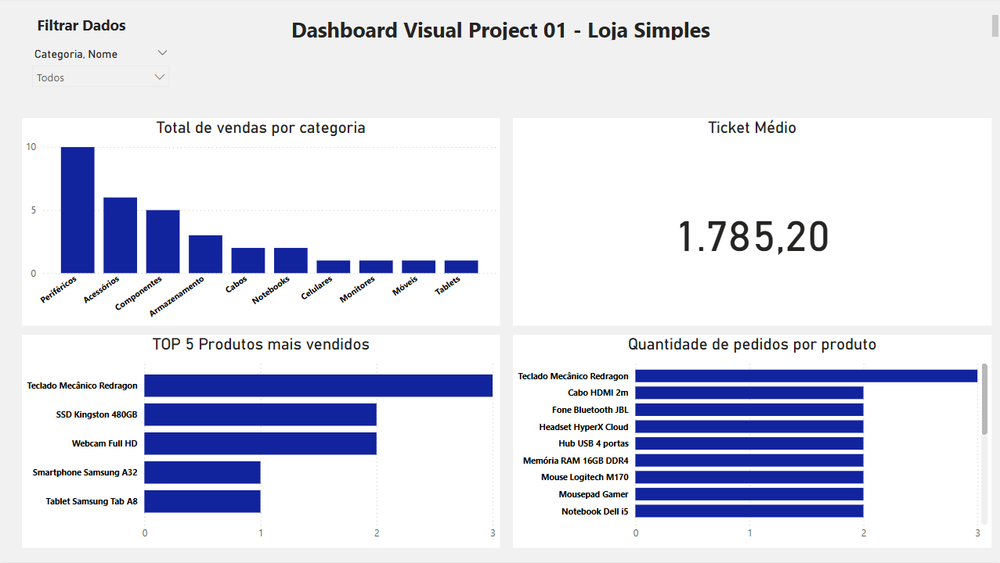

# 🛍️ First Store Dashboard - Power BI Project

Este é o primeiro projeto visual de dashboard criado com **Power BI** e **SQL**, simulando uma loja simples de produtos eletrônicos.

O objetivo foi criar um painel interativo que mostrasse os principais indicadores de vendas, produtos mais vendidos e categorias com maior volume de vendas.

---

## 🔧 Tecnologias utilizadas

- Power BI (modelagem, visualização e DAX básico)
- SQL (criação de views, filtros e transformação de dados)

---

## 📊 O que o dashboard mostra:

- **Total de vendas por categoria**
- **Top 5 produtos mais vendidos**
- **Quantidade de pedidos por produto**
- **Ticket médio**

---

## 📌 Insights obtidos

- A categoria **Periféricos** representa o maior número de vendas.
- O **Teclado Mecânico Redragon** é o produto mais vendido e o mais pedido.
- O ticket médio das vendas é de aproximadamente **R$1.785,20**, indicando um foco em produtos de valor médio a alto.

---

## 🖼️ Imagem do Dashboard

---

## 📁 Arquivos

- `First-Store.pbix`: Arquivo do Power BI
- `queries.sql`: Script com as queries SQL utilizadas
